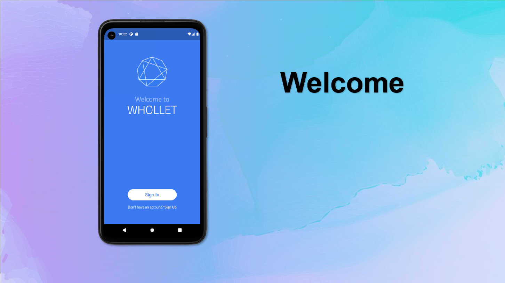
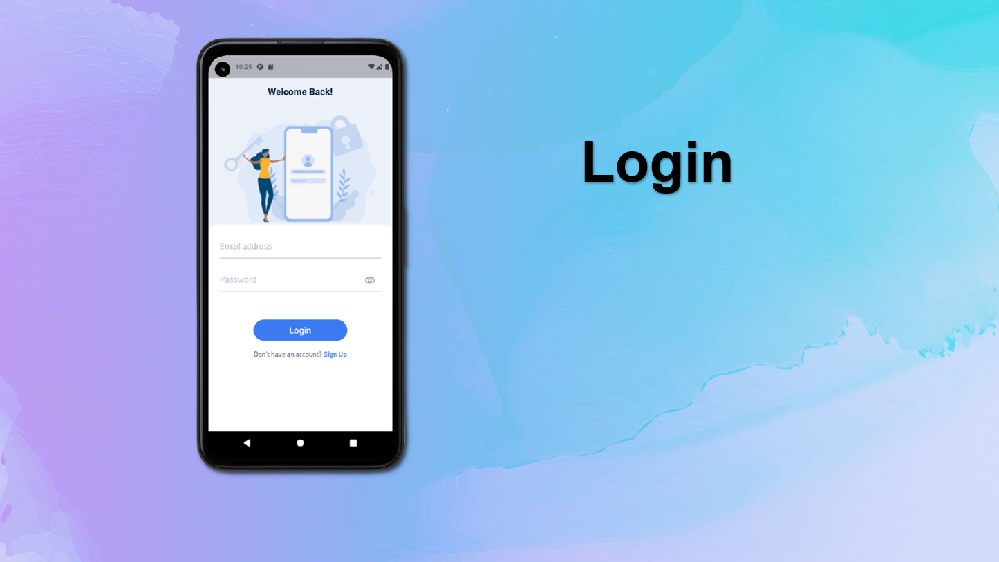
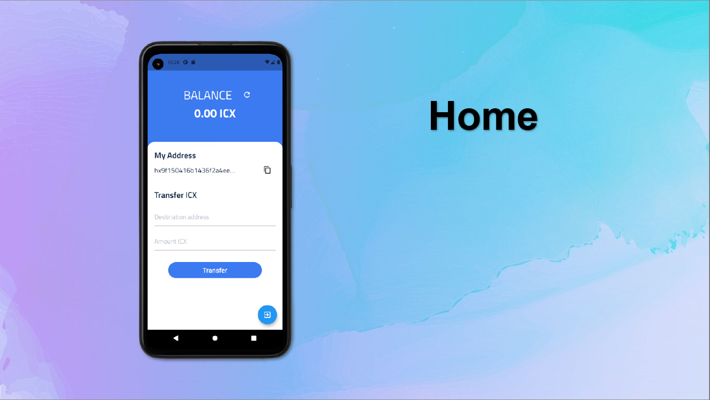

<h1 align="center">Whollet Wallet</h1>

A simple ICON wallet on Testnet

 

## Getting Started

This project is used in Devera Flutter course to demonstrate how to use ICON SDK.

## ICON ICX Testnet Faucet
- [Testnet](https://faucet.ibriz.ai/)

## Interface

## Pub Packages

| Package  | Usage |
| ------ | ------ |
| [Flutter Icon Network](https://pub.dev/packages/flutter_icon_network) |  ICON supports SDK for 3rd party or user services development on Icon network. 
| [Firebase Core](https://pub.dev/packages/firebase_core) | A Flutter plugin to use the Firebase Core API, which enables connecting to multiple Firebase apps.
| [Firebase Auth](https://pub.dev/packages/provider) | Firebase Authentication provides backend services & easy-to-use SDKs to authenticate users to your app. 
| [Cloud Firestore](https://pub.dev/packages/cloud_firestore) | Firestore is a flexible, scalable NoSQL cloud database to store and sync data.
